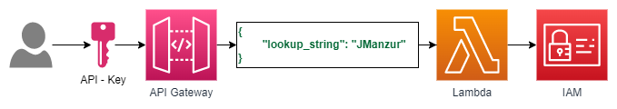

# IAM Lookup Lambda

A simple python lambda function to look up IAM users using regular expressions.

> :information_source: This is just a demo, you can use it as a starting point to automate a larger project.

## Resources deployed by this manifest:

- Python lambda function
- IAM Role
- API-Gateway

### Deployment diagram:



## Tested with: 

| Environment | Application | Version  |
| ----------------- |-----------|---------|
| WSL2 Ubuntu 20.04 | Terraform | v1.2.9  |

## Initialization How-To:

Located in the root directory, make an "aws configure" to log into the aws account, and a "terraform init" to download the necessary modules and start the backend.

```bash
aws configure
terraform init
```

## Deployment How-To:

Located in the root directory, make the necessary changes in the variables.tf file and run the manifests:

```bash
terraform apply
```

## Author:

- [@JManzur](https://jmanzur.com)

## Documentation:

- [Boto3 list_users documentation](https://boto3.amazonaws.com/v1/documentation/api/latest/reference/services/iam.html#IAM.Client.list_users)